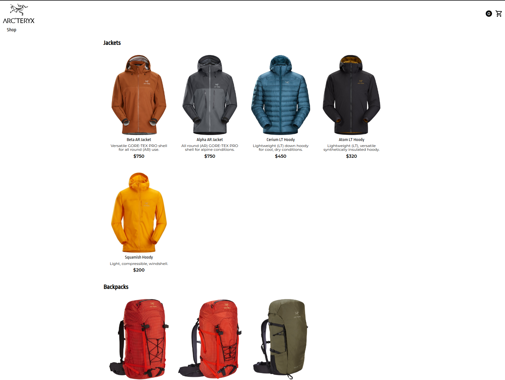
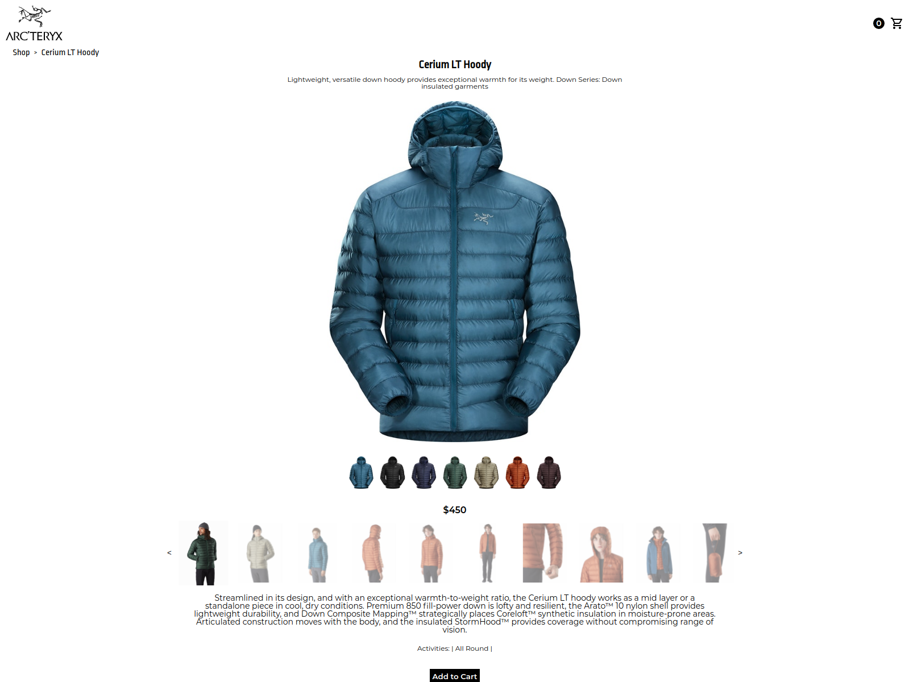
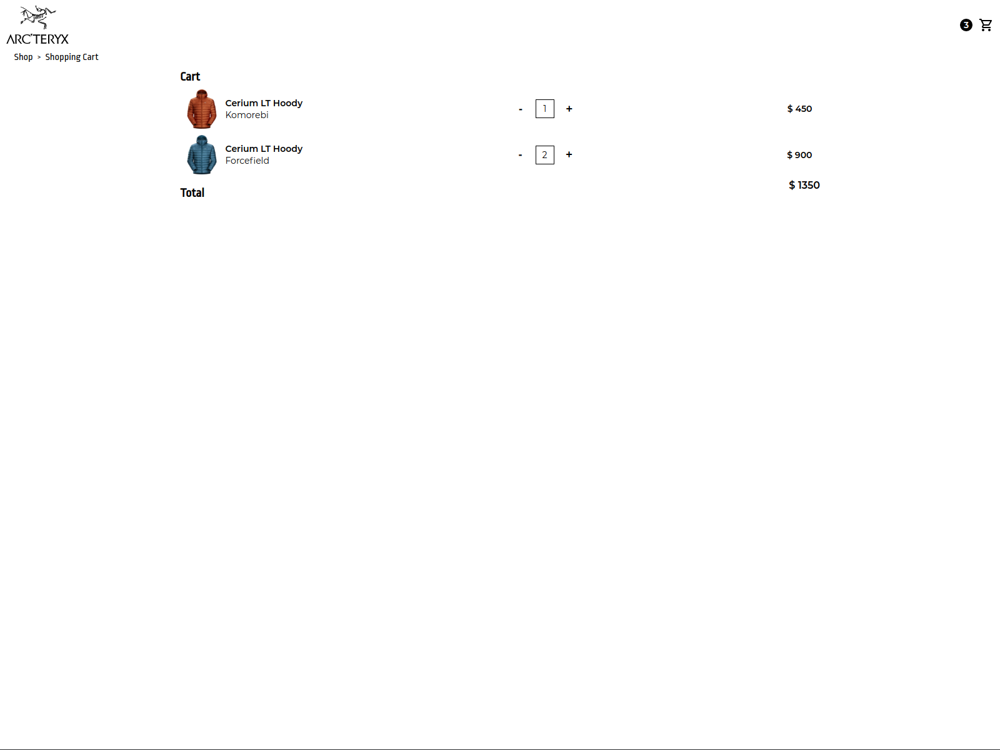
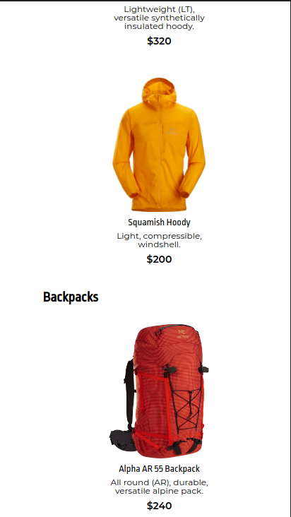
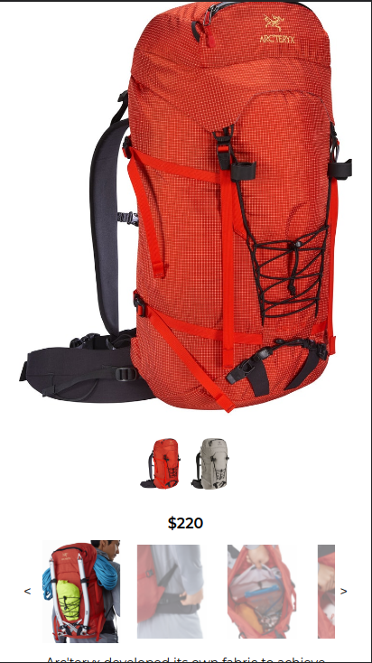
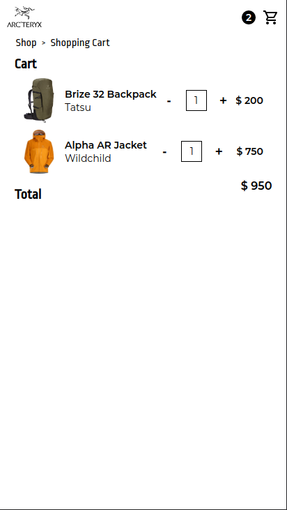

<!--
*** Thanks for checking out the Best-README-Template. If you have a suggestion
*** that would make this better, please fork the repo and create a pull request
*** or simply open an issue with the tag "enhancement".
*** Don't forget to give the project a star!
*** Thanks again! Now go create something AMAZING! :D
-->

<!-- PROJECT SHIELDS -->
<!--
*** I'm using markdown "reference style" links for readability.
*** Reference links are enclosed in brackets [ ] instead of parentheses ( ).
*** See the bottom of this document for the declaration of the reference variables
*** for contributors-url, forks-url, etc. This is an optional, concise syntax you may use.
*** https://www.markdownguide.org/basic-syntax/#reference-style-links
-->

<!-- [![Contributors][contributors-shield]][contributors-url]
[![Forks][forks-shield]][forks-url]
[![Stargazers][stars-shield]][stars-url]
[![Issues][issues-shield]][issues-url]
[![MIT License][license-shield]][license-url] -->

[![LinkedIn][linkedin-shield]][linkedin-url]

<!-- PROJECT LOGO -->
 

  

<h3 align="center">Shopping Cart</h3>

  

    A shopping cart built in React using React Router and Typescript.
     
    <a href="https://github.com/craigmclean39/shopping-cart-top"><strong>Explore the docs »</strong></a>
     
     
    <a href="https://craigmclean39.github.io/shopping-cart-top/">View Demo</a>
    ·
    <a href="https://github.com/craigmclean39/shopping-cart-top/issues">Report Bug</a>
    ·
    <a href="https://github.com/craigmclean39/shopping-cart-top/issues">Request Feature</a>
  

<!-- TABLE OF CONTENTS -->

  
<h2 style="display: inline-block">Table of Contents</h2>

  <ol>
    <li>
      <a href="#about-the-project">About The Project</a>
      <ul>
        <li><a href="#built-with">Built With</a></li>
        <li><a href="#libraries-used">Libraries Used</a></li>
      </ul>
    </li>
    <li>
      <a href="#getting-started">Getting Started</a>
    </li>
    <li><a href="#features">Features</a></li>
    <li><a href="#contact">Contact</a></li>
    <li><a href="#acknowledgements">Acknowledgements</a></li>
  </ol>

<!-- ABOUT THE PROJECT -->

## About The Project

[![Product Name Screen Shot][product-screenshot]](https://craigmclean39.github.io/shopping-cart-top/)

This project was part of The Odin Project Full Stack JavaScript curriculum. The purpose of this project was to get some practice using React Router. I've created a simple web shop inspired by the Arc'teryx website. I've used react router to navigate to unique, dynamically generated product pages and I use the useLocation hook to pass product details to the generated page. I use the useContext hook to keep track of the users shopping cart data. All components are functional components and utilize hooks. I've also used this project as an opportunity to try using Typescript. I mostly use it in the form of creating interfaces, all props are passed using unique interfaces.

(<a href="#top">back to top</a>)

### Built With

- [JavaScript](https://developer.mozilla.org/en-US/docs/Web/JavaScript)
- [CSS](https://developer.mozilla.org/en-US/docs/Web/CSS)
- [React.js](https://reactjs.org/)
- [Typescript](https://www.typescriptlang.org/)

### Libraries Used

- [React Router](https://reactrouter.com/)

(<a href="#top">back to top</a>)

<!-- GETTING STARTED -->

## Getting Started

Take a look at the demo <a href="https://craigmclean39.github.io/shopping-cart-top/">here.</a>

## Features

- A shop page that is generated from a JSON file. The JSON file contains product information sorted into different categories. The page parses this information and creates the shop page.

- A product details page that is also dynamically generated from the JSON data. The data is passed to the page through the react router useLocation hook. The details page also includes a small image carousel component that I created. From this page the user can add an item to the shopping cart. The quantity displayed in the header will update accordingly. The same product, in different colors, will show up as unique items in the cart.

- A shopping cart page that shows all items the user has added to their cart, along with prices and total price. The user can change the quantity of the item on the page.

- The shop is fully responsive.

(<a href="#top">back to top</a>)

<!-- CONTACT -->

## Contact

Craig McLean - craig@craigmclean.dev 
https://www.linkedin.com/in/mcleancraig/

Project Link: [https://github.com/craigmclean39/shopping-cart-top](https://github.com/craigmclean39/shopping-cart-top)

(<a href="#top">back to top</a>)

<!-- ACKNOWLEDGMENTS -->

## Acknowledgments

- [The Odin Project](https://www.theodinproject.com/)
- [Google Fonts](https://fonts.google.com/)
- [Arc'teryx](https://www.arcteryx.com)

(<a href="#top">back to top</a>)

<!-- MARKDOWN LINKS & IMAGES -->
<!-- https://www.markdownguide.org/basic-syntax/#reference-style-links -->

[linkedin-shield]: https://img.shields.io/badge/-LinkedIn-black.svg?style=for-the-badge&logo=linkedin&colorB=555
[linkedin-url]: https://www.linkedin.com/in/mcleancraig/
[product-screenshot]: ./images/shop-full.png
